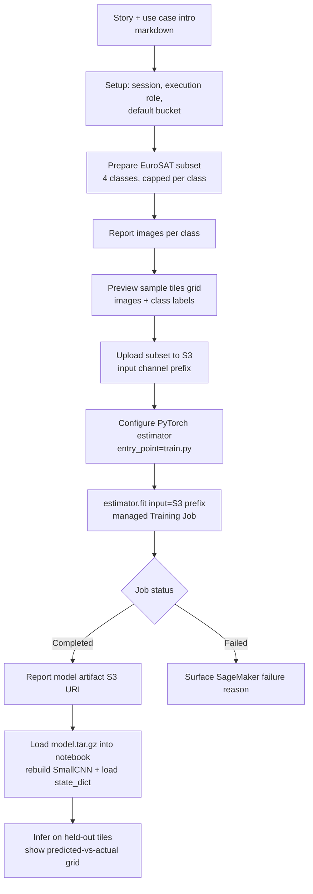

# Design Document

## Overview

This demo shows how to train a satellite-imagery model on Amazon SageMaker from inside SageMaker JupyterLab, with Kiro assisting along the way. It is framed around a generic conservation use case: classifying satellite tiles into four land cover / land use categories — forest, water, cropland, and urban — as a way to track habitat and land change over time.

The design favors clarity over accuracy and production-readiness. The entire experience is one guided notebook that narrates a continuous story and orchestrates the workflow: prepare a small subset of the public EuroSAT dataset, stage it in S3, launch a SageMaker managed training job using the PyTorch estimator, and report where the trained model landed. The model itself is a small custom PyTorch CNN trained from scratch, defined in a standalone `train.py` so a reader can see and adapt exactly what is being trained.

Two design principles run throughout:

- **Managed training, not in-notebook training.** The notebook never trains the model in its own process. It configures an estimator and calls `fit()`, so training runs on managed infrastructure. This mirrors real SageMaker workflows and keeps the notebook fast and light.
- **Minimal, well-explained setup.** The notebook uses SageMaker's default execution-role resolution and default bucket, a single dependency file, and the smallest set of dependencies that gets the job done. Every AWS resource or permission is named and justified in plain language before it is used.

## File Structure

The deliverables are intentionally few. Everything lives under a single demo directory.

```
satellite-model-demo/
├── satellite_land_cover_demo.ipynb   # The single guided notebook (orchestrator + narration)
├── train.py                          # Standalone SageMaker training entry point
└── requirements.txt                  # Single dependency specification file
```

| File | Role | Requirements |
|------|------|--------------|
| `satellite_land_cover_demo.ipynb` | The one notebook that narrates the story and orchestrates every step: setup → data prep → sample preview → S3 upload → estimator config → `fit()` → report artifact location → load model → prediction grid. | 1.1, 1.2, 1.3, 1.5, 6.1, 6.2, 7.1, 7.2, 7.3 |
| `train.py` | The training entry point run by the managed training job. Defines the CNN, reads the input channel, trains, and saves the artifact. | 3.1, 3.2, 3.3, 3.4, 3.5, 3.6 |
| `requirements.txt` | The single place dependencies are declared. | 5.4, 5.5 |

### Dependency specification (`requirements.txt`)

Dependencies are limited to what is needed to prepare data, launch the training job, and run the training script. The notebook environment needs the SageMaker SDK and the tools to download and subset EuroSAT; the training container already ships PyTorch, so `train.py` relies on the framework version the estimator selects.

```
sagemaker>=2.200
torch
torchvision
matplotlib
```

- `sagemaker` — configure the estimator, resolve role/bucket, launch and monitor the training job.
- `torchvision` — download EuroSAT and read images (torchvision provides a built-in EuroSAT dataset and image transforms).
- `torch` — used by both the local prep step (tensors/transforms) and the training script.
- `matplotlib` — draw the two in-notebook visualizations: the sample-tiles grid before training and the predicted-vs-actual grid after training.

There is exactly one dependency file, satisfying the "single dependency specification file" constraint.

## Workflow Architecture

The notebook is a linear, top-to-bottom sequence. Each code cell is preceded by a markdown cell that explains the "why" before the "how", and every SageMaker-specific setup step names the AWS resource or permission it needs and the reason for it.



### Notebook sections (cell-by-cell narrative)

1. **The story.** Introduce the conservation framing: land cover / land use classification helps track habitat and land change over time. Explain the four classes and why satellite tiles are a natural signal. (1.3, 6.2)
2. **Where Kiro helps.** A short note calling out where Kiro assists inside SageMaker JupyterLab — generating the training script, wiring the estimator, and explaining SageMaker concepts. (6.1)
3. **SageMaker setup.** Create a `sagemaker.Session`, resolve the execution role via default resolution, and pick the default bucket. Narrate why a role and a bucket are required. (5.1, 5.2, 5.3)
4. **Prepare the dataset subset.** Download EuroSAT via torchvision, select only the categories mapped to the four target classes, and cap the number of images per class to keep the footprint small and training fast. (2.1, 2.2, 2.3)
5. **Report per-class counts.** Print the number of images prepared per class so the user sees the subset composition. (2.5)
6. **Preview sample tiles (before training).** Draw a small matplotlib grid of tiles sampled from the local subset — a few per target class — each annotated with its class label (forest, water, cropland, urban). This shows the audience what the model learns from. Pure notebook cell on already-local images; it does not touch the training job. (7.1)
7. **Upload to S3.** Upload the prepared subset to the default bucket under a demo prefix; this becomes the training job's input channel. (2.4)
8. **Configure the estimator.** Build a `PyTorch` estimator with `entry_point="train.py"`, small hyperparameters, and a small instance type. Narrate each key argument. (4.1, 4.4)
9. **Launch the training job.** Call `fit()` with the S3 input channel. Emphasize that training runs on managed infrastructure, not in the notebook. (4.2, 4.3)
10. **Report results.** On success, print `estimator.model_data` (the artifact S3 URI). On failure, surface the SageMaker failure reason. (4.5, 4.6)
11. **Load the trained model back into the notebook (after training).** Download the `model.tar.gz` artifact from `estimator.model_data`, extract `model.pth`, reconstruct `SmallCNN(num_classes=4)`, and load the saved `state_dict`. Narrate that this brings the managed job's result back locally purely for visualization. (7.2)
12. **Show predicted-vs-actual grid.** Run the loaded model in eval mode on a small held-out set of tiles (set aside during prep, not uploaded for training), then draw a matplotlib grid annotating each tile with its predicted and actual label. This is the visible "it works" payoff. (7.3)

## Data Preparation & Subset Flow

EuroSAT contains ten land-use categories. The demo maps a subset of those categories onto the four target classes and caps images per class.

### Class mapping

| Target class | EuroSAT source category |
|--------------|-------------------------|
| forest | `Forest` |
| water | `SeaLake` |
| cropland | `AnnualCrop` |
| urban | `Industrial` |

Only images from the four selected source categories are kept; each is relabeled to its target class. The result is a four-class problem regardless of which EuroSAT categories were chosen.

### Subset selection

- Download EuroSAT once (torchvision handles caching).
- For each of the four target classes, take at most `IMAGES_PER_CLASS` images (a small number, e.g. 200). This keeps the subset well under the full dataset size and keeps upload and training quick.
- Write the subset to a local directory in an `ImageFolder`-style layout so the training script can read it with a standard loader:

```
data/
├── forest/    *.jpg
├── water/     *.jpg
├── cropland/  *.jpg
└── urban/     *.jpg
```

- After writing, count the files placed in each class directory and print the per-class totals.

Pseudocode for the prep step (runs locally in the notebook):

```python
TARGET_CLASSES = ["forest", "water", "cropland", "urban"]
SOURCE_FOR = {"forest": "Forest", "water": "SeaLake",
              "cropland": "AnnualCrop", "urban": "Industrial"}
IMAGES_PER_CLASS = 200

def prepare_subset(eurosat, out_dir, cap, holdout=2):
    counts, held_out = {}, []
    for target, source in SOURCE_FOR.items():
        images = images_of_category(eurosat, source)[:cap]
        # set aside a few tiles per class for the post-training prediction grid
        held_out += [(img, target) for img in images[:holdout]]
        write_images(out_dir / target, images)
        counts[target] = len(images)
    return counts, held_out  # counts reported to the user; held_out kept in-memory
```

## S3 Layout

Data and artifacts use the SageMaker default bucket. The notebook stages the subset under a demo-scoped prefix; SageMaker writes the model artifact under its own job-scoped prefix.

```
s3://<default-bucket>/
├── satellite-land-cover-demo/
│   └── data/                        # uploaded Dataset_Subset (input channel)
│       ├── forest/ ...
│       ├── water/ ...
│       ├── cropland/ ...
│       └── urban/ ...
└── <training-job-name>/
    └── output/
        └── model.tar.gz             # produced Model artifact (estimator.model_data)
```

- **Input channel:** the estimator's `fit({"training": "s3://<bucket>/satellite-land-cover-demo/data"})` points the managed job at the uploaded subset.
- **Output:** SageMaker packages the contents of the training container's model directory into `model.tar.gz` and reports its location via `estimator.model_data`.

## CNN Architecture (High Level)

The model is a small convolutional network trained from scratch — no pretrained weights — so a reader can follow every layer. EuroSAT RGB tiles are 64×64.

```
Input: 3 x 64 x 64 RGB tile
  Conv(3 -> 16, 3x3, pad=1) -> ReLU -> MaxPool(2)      # -> 16 x 32 x 32
  Conv(16 -> 32, 3x3, pad=1) -> ReLU -> MaxPool(2)     # -> 32 x 16 x 16
  Conv(32 -> 64, 3x3, pad=1) -> ReLU -> MaxPool(2)     # -> 64 x 8 x 8
  Flatten
  Linear(64*8*8 -> 128) -> ReLU
  Linear(128 -> 4)                                     # logits for 4 classes
```

- Three conv/pool blocks keep parameter count and training time low.
- The final layer always emits exactly four logits, one per target class.
- Loss: cross-entropy. Optimizer: Adam. Both are standard and readable.

This is deliberately simple. The goal is a working end-to-end run, not accuracy.

## Training Script (`train.py`) Interface

`train.py` is the estimator entry point. It follows SageMaker's conventions for input and output locations and reads hyperparameters from the command line.

### Command-line arguments

| Argument | Source | Default | Purpose |
|----------|--------|---------|---------|
| `--epochs` | hyperparameter | small (e.g. 3) | number of training epochs (3.6) |
| `--batch-size` | hyperparameter | small (e.g. 32) | mini-batch size (3.6) |
| `--data-dir` | `SM_CHANNEL_TRAINING` env | env-provided | input data path (3.4) |
| `--model-dir` | `SM_MODEL_DIR` env | env-provided | model output path (3.5) |

SageMaker passes hyperparameters as CLI args and sets the `SM_CHANNEL_TRAINING` / `SM_MODEL_DIR` environment variables, which are used as argument defaults.

### Behavior

```python
def main():
    args = parse_args()                      # epochs, batch-size, data-dir, model-dir
    loader = build_loader(args.data_dir, args.batch_size)   # ImageFolder -> DataLoader
    model = SmallCNN(num_classes=4)          # from scratch, no pretrained weights
    train(model, loader, epochs=args.epochs) # cross-entropy + Adam
    save(model, args.model_dir)              # torch.save -> SM_MODEL_DIR/model.pth
```

On completion the script writes the model to `--model-dir`, which SageMaker collects into `model.tar.gz`.

## Estimator Configuration

The notebook configures a `sagemaker.pytorch.PyTorch` estimator and launches the job with `fit()`.

```python
from sagemaker.pytorch import PyTorch

estimator = PyTorch(
    entry_point="train.py",            # 4.1
    source_dir=".",                    # ships train.py (and requirements.txt if used)
    role=role,                         # default-resolved execution role (5.1)
    instance_type="ml.m5.large",       # small; CPU is fine for a tiny model/subset
    instance_count=1,
    framework_version="2.2",           # pins the managed PyTorch container
    py_version="py310",
    hyperparameters={                  # sized to keep the job short (4.4)
        "epochs": 3,
        "batch-size": 32,
    },
    output_path=f"s3://{bucket}/",     # where model.tar.gz is written
)

estimator.fit({"training": s3_data_uri})   # managed job, S3 input channel (4.2, 4.3)
```

### Result reporting

```python
# On success (4.5)
print("Model artifact:", estimator.model_data)

# On failure (4.6)
# fit() raises; catch it and surface the SageMaker failure reason
try:
    estimator.fit({"training": s3_data_uri})
    print("Model artifact:", estimator.model_data)
except Exception:
    reason = describe_training_job(estimator.latest_training_job.name)["FailureReason"]
    print("Training job failed:", reason)
```

The notebook reads the failure reason from the training job description (`FailureReason`) so the user sees why a job failed rather than a bare traceback.

## Visualization (In-Notebook)

Two matplotlib visualizations bracket the training job. Both run as ordinary notebook cells against already-local images and never alter the managed training job.

### Held-out tiles

During data prep, a small number of tiles per class (e.g. a handful) are set aside into an in-memory held-out list of `(image, actual_label)` pairs. These are **not** uploaded to S3 and are used only for the post-training prediction grid, so the "it works" check runs on tiles the model did not train on.

### Sample tiles preview (before training)

A helper draws a grid of a few sampled tiles per target class, each titled with its class label, so the audience sees the kind of imagery the model learns from.

```python
import matplotlib.pyplot as plt

def show_sample_grid(samples):            # samples: list of (image, label)
    n = len(samples)
    cols = 4
    rows = (n + cols - 1) // cols
    fig, axes = plt.subplots(rows, cols, figsize=(cols * 2, rows * 2))
    for ax, (img, label) in zip(axes.ravel(), samples):
        ax.imshow(img)
        ax.set_title(label)
        ax.axis("off")
    plt.tight_layout()
    plt.show()
```

### Load the trained artifact (after training)

The trained model is brought back into the notebook for inference: download `model.tar.gz` from `estimator.model_data`, extract `model.pth`, rebuild the same `SmallCNN`, and load the saved weights.

```python
import tarfile, torch
from urllib.parse import urlparse

def load_trained_model(model_data_uri, download_fn):
    local_tar = download_fn(model_data_uri, "model.tar.gz")   # S3 -> local
    with tarfile.open(local_tar) as t:
        t.extractall("model")                                 # yields model/model.pth
    model = SmallCNN(num_classes=4)                           # same architecture
    model.load_state_dict(torch.load("model/model.pth", map_location="cpu"))
    model.eval()
    return model
```

### Predicted-vs-actual grid (after training)

Run the loaded model on the held-out tiles and draw a grid annotating each tile with both its predicted and actual label. Every predicted label is mapped back through the four target classes, and the grid annotates exactly the tiles that were sampled.

```python
TARGET_CLASSES = ["forest", "water", "cropland", "urban"]

def show_prediction_grid(model, held_out, to_tensor):
    cols = 4
    rows = (len(held_out) + cols - 1) // cols
    fig, axes = plt.subplots(rows, cols, figsize=(cols * 2, rows * 2))
    for ax, (img, actual) in zip(axes.ravel(), held_out):
        logits = model(to_tensor(img).unsqueeze(0))
        pred = TARGET_CLASSES[int(logits.argmax(dim=1))]
        ax.imshow(img)
        ax.set_title(f"pred: {pred}\nactual: {actual}")
        ax.axis("off")
    plt.tight_layout()
    plt.show()
```

## Error Handling

| Scenario | Handling | Requirement |
|----------|----------|-------------|
| Training job fails on managed infra | Catch the exception from `fit()`, read `FailureReason` from the job description, and print it. | 4.6 |
| Execution role cannot be resolved | Default resolution is used; if it fails, the notebook narrates that a SageMaker execution role is required and why. | 5.1, 5.3 |
| No bucket specified | Fall back to the SageMaker default bucket. | 5.2 |
| EuroSAT download interrupted | torchvision retries/caches; re-running the cell resumes. The linear cell order means a re-run is safe. | 1.5 |

Because the notebook is linear and each step is idempotent enough to re-run, recovery from a transient error is "re-run the cell", keeping the demo simple.

## Correctness Properties

*A property is a characteristic or behavior that should hold true across all valid executions of a system — essentially, a formal statement about what the system should do. Properties serve as the bridge between human-readable specifications and machine-verifiable correctness guarantees.*

### Property 1: Subset stays small and per-class capped

For any per-class cap `N` smaller than the smallest full EuroSAT category size, the prepared subset SHALL contain at most `N` images per class and a total number of images strictly less than the full EuroSAT dataset size.

**Validates: Requirements 2.2**

### Property 2: Label domain is exactly the four target classes

For any prepared subset, the set of distinct class labels SHALL equal exactly {forest, water, cropland, urban}, regardless of which EuroSAT source categories were selected.

**Validates: Requirements 2.3**

### Property 3: Reported counts match on-disk counts

For any subset selection, the per-class image counts reported to the user SHALL equal the actual number of image files written to each corresponding class directory, and the reported total SHALL equal their sum.

**Validates: Requirements 2.5**

### Property 4: Model emits one logit per class

For any input batch of `B` valid 3×64×64 image tensors, the model's forward pass SHALL produce an output of shape `(B, 4)` — exactly four logits per sample.

**Validates: Requirements 3.3**

### Property 5: Hyperparameter arguments round-trip through the parser

For any non-negative integer values supplied for `--epochs` and `--batch-size`, the training script's argument parser SHALL return those exact values.

**Validates: Requirements 3.6**

### Property 6: Prediction grid annotates every sampled tile with a valid class

For any held-out set of `K` tiles and any model output of shape `(K, 4)`, the predicted-vs-actual grid SHALL annotate exactly `K` tiles, and each annotated predicted label SHALL be one of the four target classes {forest, water, cropland, urban}.

**Validates: Requirements 7.1, 7.3**

## Testing Strategy

The demo prioritizes clarity, but the testable logic (subset preparation, the model's output shape, and argument parsing) is amenable to automated tests.

**Property tests** (minimum 100 iterations each, tagged to the properties above):
- Generate random per-class caps and verify subset size bounds and per-class caps (Property 1).
- Generate random subset selections and verify the label set equals the four target classes (Property 2) and that reported counts equal on-disk counts (Property 3).
- Generate random valid batch sizes and verify the model output shape is `(B, 4)` (Property 4).
- Generate random non-negative integer hyperparameter values and verify the parser returns them unchanged (Property 5).
- Generate random held-out sets of size `K` and random `(K, 4)` model outputs and verify the prediction grid annotates exactly `K` tiles and every predicted label is one of the four target classes (Property 6).

**Unit / example tests:**
- Failure reporting: given a failed job description, confirm the notebook surfaces the `FailureReason` (Requirement 4.6).

**Integration / smoke tests** (single or few executions, not property-based — these exercise AWS and infrastructure wiring):
- End-to-end run in JupyterLab with only the declared dependencies (Requirements 1.5, 6.3).
- Upload subset to S3 and confirm objects exist at the expected prefix (Requirement 2.4).
- Estimator launches a managed training job with `train.py` as entry point and the S3 input channel (Requirements 4.1, 4.2, 4.3), and `estimator.model_data` reports the artifact URI (Requirement 4.5).
- `train.py` reads `SM_CHANNEL_TRAINING` and writes an artifact to `SM_MODEL_DIR` (Requirements 3.4, 3.5).
- Role/bucket resolution uses defaults (Requirements 5.1, 5.2).

Property tests run at least 100 iterations because they rely on randomized inputs, and each references its design property using the tag format **Feature: satellite-model-demo, Property {number}: {property_text}**.
